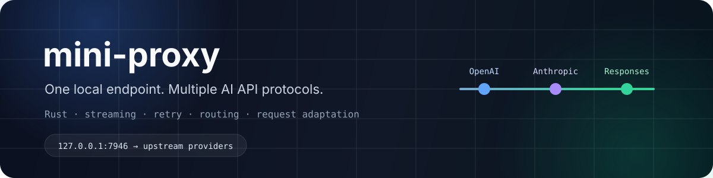

 

  

**一个轻量的本地 AI API 代理：协议透传、自动重试、模型路由、请求适配，单可执行文件部署。**

---

## 为什么要用 mini-proxy？

不同 AI 编程客户端往往使用不同的接口协议，即使它们最后访问的是相似的模型服务。

mini-proxy 提供一个统一的**本地 Base URL**，再按请求路径自动识别协议：

<table>
<tr>
<td width="33%" align="center"><b>OpenAI 风格</b> <code>/chat/completions</code></td>
<td width="33%" align="center"><b>Anthropic 风格</b> <code>/v1/messages</code></td>
<td width="33%" align="center"><b>Responses 风格</b> <code>/responses</code></td>
</tr>
</table>

它适合本地模型网关、Coding Plan 接口、兼容层，以及希望在多个上游服务前面保持一个稳定入口的场景。

---

## 主要特性

| 能力 | 说明 |
|---|---|
| 🔀 **三种协议入口** | OpenAI Chat Completions、Anthropic Messages、Responses API 风格请求 |
| ♻️ **自动重试** | 同时支持 HTTP 状态码范围与上游业务错误码判断 |
| 🌊 **SSE 流式转发** | 保留流式响应，并能在流的早期事件中识别可重试错误 |
| 🔑 **两种 API Key 模式** | 客户端 Key 透传，或使用配置覆盖 |
| 🗺️ **模型映射** | 客户端模型名映射到上游真实模型名 |
| 🧹 **请求清洗** | 可选的语义感知清洗；即使文本为空，也保留 tool/function 消息 |
| 🧠 **思考强度注入** | 可按协议强制指定思考强度，也可以完全透传客户端设置 |
| 🧩 **配置继承** | provider 级公共配置 + 各协议端点局部覆盖 |
| 🪪 **请求头注入** | 仅在客户端未提供同名头时补充静态请求头 |
| 🧵 **OpenCode 会话支持** | 可自动生成 / 传播 <code>x-opencode-session</code> |
| 📦 **单文件部署** | 编译后直接运行，首次启动可生成配置 |
| 🪵 **结构化日志** | 基于 <code>tracing</code> 的控制台与滚动文件日志 |

---

## 快速开始

### Windows

下载或自行编译 <code>mini-proxy.exe</code>，直接运行：

~~~powershell
mini-proxy.exe
~~~

首次运行时可自动生成 <code>config.toml</code> 并使用当前默认配置启动。

### 从源码编译

~~~bash
cargo build --release
~~~

产物：

~~~text
target/release/mini-proxy
~~~

Windows：

~~~text
target/release/mini-proxy.exe
~~~

### 查看完整配置说明

~~~bash
mini-proxy --help
~~~

---

## 请求流程

~~~text
Cursor / Claude Code / Codex / 其他客户端
                    │
                    ▼
          http://127.0.0.1:7946
                    │
        ┌───────────┼───────────┐
        ▼           ▼           ▼
 /chat/completions /v1/messages /responses
      OpenAI        Anthropic    Responses
        │           │           │
        └────── provider 路由 ───┘
                    │
          模型映射 / 请求头
        重试 / Key 处理
          思考强度适配
                    │
                    ▼
               上游 API
~~~

---

## 对外端点

| 协议 | 完整请求路径 | SDK Base URL |
|---|---|---|
| OpenAI 风格 | <code>POST http://&lt;listen&gt;/chat/completions</code> | <code>http://&lt;listen&gt;</code> |
| Anthropic 风格 | <code>POST http://&lt;listen&gt;/v1/messages</code> | <code>http://&lt;listen&gt;</code> |
| Responses 风格 | <code>POST http://&lt;listen&gt;/responses</code> | <code>http://&lt;listen&gt;</code> |

默认监听地址：

~~~text
127.0.0.1:7946
~~~

三种协议共用同一个 Base URL，由 mini-proxy 根据请求路径自动区分。

---

## 配置

最小示例：

~~~toml
[server]
listen = "127.0.0.1:7946"
clean_empty_content = false

[log]
level = "info"
format = "pretty"
to_stdout = true
to_file = "logs/proxy.log"
rotate_size_mb = 50
rotate_keep = 7

[[provider]]
name = "ExampleProvider"
api_key = ""
models = ["model-a", "model-b"]
max_retries = 10000
key_mode = "passthrough"
thinking_effort = "passthrough"

[provider.openai]
base_url = "https://example.com/v1"

[provider.anthropic]
base_url = "https://example.com"

[provider.responses]
base_url = "https://example.com/v1"
~~~

仓库中的 <code>config.toml</code> 已包含更完整的字段说明与可运行 provider 示例。

### Provider 核心字段

| 字段 | 含义 | 常见 / 默认行为 |
|---|---|---|
| <code>name</code> | 日志中显示的供应商名称 | 必填 |
| <code>api_key</code> | override 模式使用的 Key | 空 |
| <code>models</code> | 该 provider 接管的客户端模型 ID | 按供应商配置 |
| <code>model_map</code> | 客户端模型名 → 上游模型名 | 未配置时同名透传 |
| <code>max_retries</code> | 同供应商同模型最大重试次数 | <code>10000</code> |
| <code>retry_on_status</code> | 可重试 HTTP 状态码 / 范围 | 未填写时使用内置默认值 |
| <code>retry_on_code</code> | 可重试的上游业务错误码 | 未填写时使用内置默认值 |
| <code>key_mode</code> | <code>passthrough</code> / <code>override</code> | <code>passthrough</code> |
| <code>path_mode</code> | <code>append</code> / <code>full</code> | <code>append</code> |
| <code>thinking_effort</code> | 强制思考档位，或原样透传 | 未填写时按协议默认处理 |
| <code>is_opencode</code> | 开启 OpenCode 会话头处理 | <code>false</code> |
| <code>headers</code> | 客户端未提供时才注入的静态请求头 | 空 |

<code>[provider.openai]</code>、<code>[provider.anthropic]</code>、<code>[provider.responses]</code> 会继承 provider 级配置，并可覆盖同名字段。

---

## 重试机制

### HTTP 状态码

未显式填写 <code>retry_on_status</code> 时，mini-proxy 使用内置默认范围。当前配置说明覆盖多数临时性 / 上游侧错误，并明确不对 <code>504</code> 和 <code>524</code> 进行重试。

### 业务错误码

mini-proxy 可以解析响应体中的 <code>error.code</code>，对配置指定的上游业务错误进行重试。

### 流式错误检测

对于 SSE：

1. 代理会预读最前面的若干事件；
2. 如果遇到可重试的 <code>event: error</code>，当前读取内容丢弃并重新请求上游；
3. 一旦确认已经出现有效内容，则把预读数据和剩余流一起转发给客户端。

这样可以尽量避免在上游刚开始输出就失败时，把已经损坏的流直接提交给客户端。

---

## API Key 模式

| 模式 | 行为 |
|---|---|
| <code>passthrough</code> | 保留客户端原始 Key，mini-proxy 不需要保存它 |
| <code>override</code> | 用配置中的 <code>api_key</code> 覆盖客户端 Key；配置为空时回退到 passthrough |

---

## 上游 URL 模式

| 模式 | 行为 |
|---|---|
| <code>append</code> | <code>base_url</code> + 协议后缀，例如 <code>/chat/completions</code> |
| <code>full</code> | 直接使用配置中的完整 <code>base_url</code> |

这样既可以适配“统一 API 根地址”的服务，也可以适配必须填写完整端点 URL 的上游。

---

## 客户端示例

### Cursor — OpenAI 风格

~~~text
Override OpenAI Base URL: http://127.0.0.1:7946
OpenAI API Key: <你的 Key>
模型: <配置中的模型 ID>
~~~

### Claude Code — Anthropic 风格

~~~json
{
  "env": {
    "ANTHROPIC_AUTH_TOKEN": "<你的 Key>",
    "ANTHROPIC_BASE_URL": "http://127.0.0.1:7946",
    "CLAUDE_CODE_DISABLE_NONESSENTIAL_TRAFFIC": "1",
    "API_TIMEOUT_MS": "600000",
    "ANTHROPIC_MODEL": "<配置中的模型 ID>"
  }
}
~~~

### Codex — Responses 风格

<code>auth.json</code>：

~~~json
{
  "OPENAI_API_KEY": "<你的 Key>"
}
~~~

客户端配置示例：

~~~toml
model_provider = "mini-proxy"
model = "<配置中的模型 ID>"
disable_response_storage = true
preferred_auth_method = "apikey"

[model_providers.mini-proxy]
name = "mini-proxy"
base_url = "http://127.0.0.1:7946"
wire_api = "responses"
~~~

---

## 日志

~~~toml
[log]
level = "info"
format = "pretty"
to_stdout = true
to_file = "logs/proxy.log"
rotate_size_mb = 50
rotate_keep = 7
~~~

项目使用 <code>tracing</code> / <code>tracing-subscriber</code>，支持控制台输出和滚动文件日志。

---

## 技术栈

---

## 项目状态

mini-proxy 目前是一个**自用项目**。随着实际使用的上游服务变化，默认配置与 provider 示例也可能继续调整。

英文文档见 **[README.md](./README.md)**。
